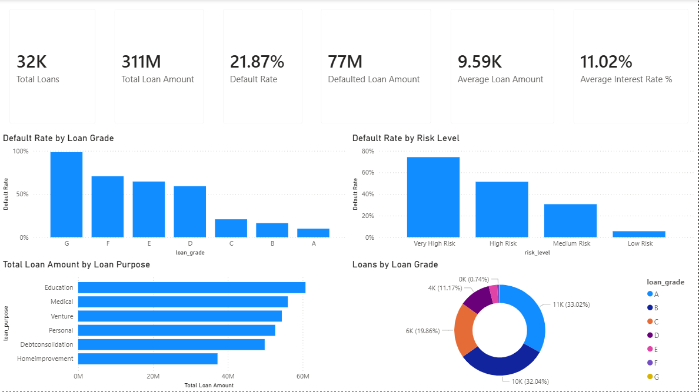
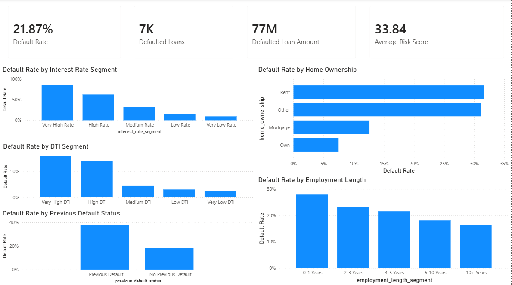
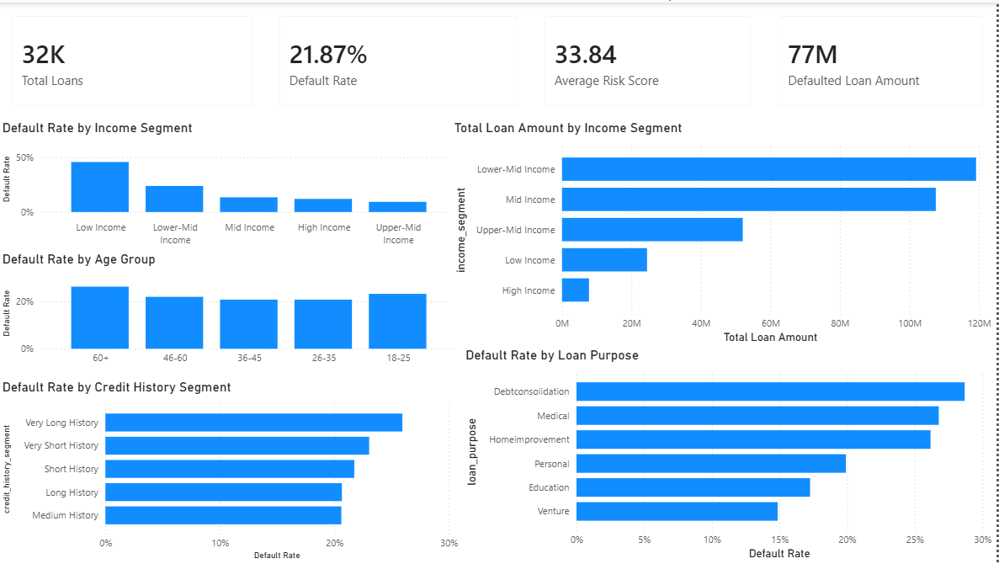
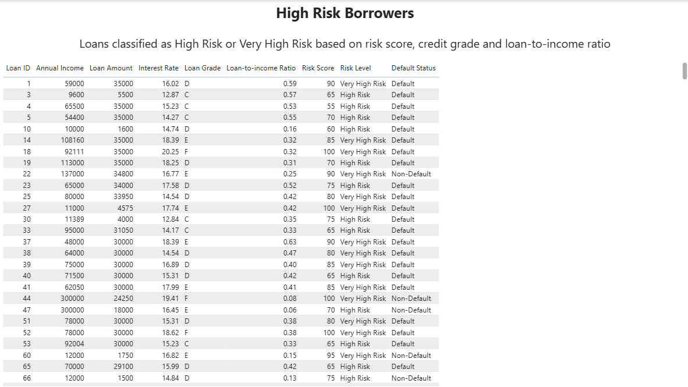

# Credit Risk & Loan Default Analytics

## Project Overview

This project analyzes credit risk and loan default patterns using Python, SQL, SQLite, and Power BI.

The main goal is to identify high-risk borrower segments, understand the key drivers of loan default, and create a dashboard that supports data-driven credit risk decisions.

The project includes the full analytical workflow:

- Data cleaning and preprocessing with Python
- Feature engineering and risk score creation
- Data validation
- Exploratory data analysis
- SQLite database creation
- SQL-based business analysis
- Power BI dashboard development
- Business insights and recommendations

---

## Business Problem

Credit institutions need to reduce loan default risk, identify risky borrower segments, and improve loan approval decisions.

This project answers the following business questions:

- What is the overall default rate in the loan portfolio?
- Which borrower segments have the highest default risk?
- How do loan grade, income, interest rate, and loan-to-income ratio affect default probability?
- Which loan purposes are associated with higher default rates?
- Can a rule-based risk score separate low-risk and high-risk borrowers?
- What actions should be recommended for each risk group?

---

## Tools Used

- Python
- pandas
- NumPy
- SQLite
- SQL
- DBeaver
- Power BI
- Markdown
- PyCharm

---

## Dataset

The dataset contains loan and borrower information, including:

- Borrower age
- Annual income
- Home ownership status
- Employment length
- Loan purpose
- Loan grade
- Loan amount
- Interest rate
- Loan-to-income ratio
- Previous default status
- Credit history length
- Loan default status

Raw dataset:

```text
data/raw/loans_raw.csv
```
Raw dataset:

```text
data/raw/loans_raw.csv
```

## Power BI Dashboard

The Power BI dashboard contains four pages:

1. Credit Portfolio Overview
2. Default Risk Analysis
3. Borrower Segments
4. High Risk Borrowers

Power BI file:

```text
powerbi/credit_risk_dashboard.pbix
```

---

## Dashboard Screenshots

### 1. Credit Portfolio Overview



---

### 2. Default Risk Analysis



---

### 3. Borrower Segments



---

### 4. High Risk Borrowers



---

## Business Recommendations

### 1. Apply strict manual review for Very High Risk borrowers

Very High Risk borrowers have a default rate of **74.19%**.

Recommended actions:

- Reject automatically in many cases
- Require manual credit review
- Request additional documentation
- Reduce approved loan amount
- Apply stricter DTI limits

---

### 2. Add stronger controls for High Risk borrowers

High Risk borrowers have a default rate of **51.37%**.

Recommended actions:

- Approve only with stronger controls
- Review income stability
- Check previous default history
- Limit loan size
- Monitor repayment behavior more closely

---

### 3. Prioritize Low Risk borrowers

Low Risk borrowers have a default rate of only **5.57%**.

Recommended actions:

- Treat as preferred lending segment
- Offer faster approval
- Use for portfolio growth
- Consider better pricing or cross-sell opportunities

---

### 4. Use loan grade and DTI as key approval signals

Loan grade and loan-to-income ratio are among the strongest default risk indicators.

Recommended actions:

- Tighten approval rules for grades D–G
- Apply maximum DTI thresholds
- Combine grade, income, and DTI in risk policy

---

## Final Conclusion

This project demonstrates an end-to-end credit risk analytics workflow.

The analysis shows that loan default risk is strongly connected with:

- Loan grade
- Borrower income
- Interest rate
- Loan-to-income ratio
- Previous default history
- Home ownership
- Employment length

The rule-based risk score successfully separates borrowers into meaningful risk groups.

The most important finding is that Very High Risk borrowers default at **74.19%**, while Low Risk borrowers default at only **5.57%**.

This project shows how Python, SQL, and Power BI can be used together to clean financial data, create analytical risk segments, identify high-risk borrowers, and support data-driven credit decision-making.
